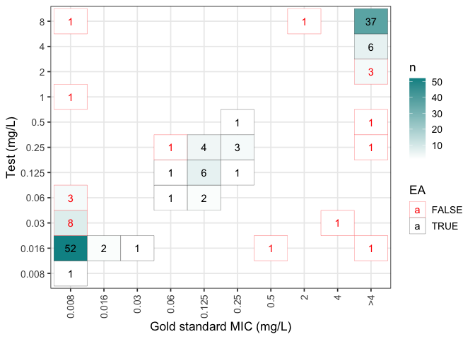

# Molecular MIC manuscript companion code
Alessandro Gerada

## Introduction

This is companion code for the ‘Molecular MIC’ manuscript. The code in
this repository generates $k$-mer and annotation models that predict
minimum inhibitory concentration (MIC) from whole genome sequence (WGS)
data.

## Data requirements

To run this analysis, the scripts require the following:

1.  a collection of WGS data in `.fna` format,
2.  annotation data for each strain, generated using
    [`AMRFinderPlus`](https://github.com/ncbi/amr); each strain should
    have a corresponding `.tsv` file with filename matching the `.fna`,
3.  a database with MIC meta-data in a format that matches the
    [`PATRIC BV-BRC AMR database`](ftp://ftp.bvbrc.org/RELEASE_NOTES/PATRIC_genomes_AMR.txt);
    we suggest using the
    [`MIC`](https://cran.r-project.org/web/packages/MIC/index.html) R
    package to format the database and save to `.txt` — see
    `MIC::load_patric_db()`.

To get started, you can use the example
[data](https://datacat.liverpool.ac.uk/3008/) used for the manuscript.
The easiest way to download the data is to use the `download_data.sh`
script:

First set up the repository:

``` bash
git clone https://github.com/agerada/molecular_mic_analysis.git
cd molecular_mic_analysis
```

``` bash
bash download_data.sh
```

This script downloads and extracts the data into the `data/` directory,
with the following structure:

    data/
    ├── annots/
    │   ├── B1.tsv
    │   ├── B2.tsv
    │   ├── ...
    ├── genomes/
    │   ├── B1.fna
    │   ├── B2.fna
    │   ├── ...
    ├── meta_data_bv_brc_format.txt
    └── meta_data_tidy.txt

## Dependencies

This repository uses
[`renv`](https://rstudio.github.io/renv/articles/renv.html) to manage
dependencies. To install the dependencies, run:

``` r
renv::restore()
```

We recommend using the
[`MIC`](https://cran.r-project.org/web/packages/MIC/index.html) and
[`AMR`](https://cran.r-project.org/web/packages/AMR/index.html) packages
for analysis of MIC and anti-microbial susceptibility data.

## Running the model

The model code is provided as a set of notebooks in the `notebooks/`
folder. These can be run interactively by configuring the `setup` chunk:

1.  set `interactive` to `TRUE`,
2.  configure the parameters in the `setup` chunk.

Alternatively, the notebooks can be converted to scripts and run using
`Rscript`. A bash script is provided that converts the notebooks to such
scripts using `knitr`:

``` bash
bash make_scripts.sh
```

This is the recommended way to run the analysis; running the interactive
notebooks is useful for troubleshooting or for changing the models.

The following scripts are generated:

- `make_kmers.R` — generates $k$-mer counts in `libsvm` format
  compatible with `XGBoost`, which are then used for the $k$-mer models.
- `tune.R` — tunes XGBoost hyperparameters for $k$-mer and annotation
  models.
- `train.R` — trains the $k$-mer and annotation models.

Both `tune.R` and `train.R` use “flat” cross-validation; however,
`_nested.R` variants are available that use nested cross-validation,
which is useful if external validation data is not available.

The duration of model training depends primarily on the following
parameters:

- `-k, --kmer` — the size of the $k$-mers,
- `-e, --eta` and `-r, --rounds` — the learning rate and max number of
  boosting rounds for XGBoost,
- `-f, --folds` — the number of folds for cross-validation.

The general workflow is to first generate $k$-mer counts using
`make_kmers.R`, then tune the hyperparameters using `tune.R`, and
finally train the models using `train.R`. The output is saved in the
directory specified by the `-o, --output` parameter.

Example scripts are provided, which use the above data to generate
$3$-mer models for gentamicin and ciprofloxacin. [^1]

``` bash
bash examples/make_mers.sh
bash examples/tune_and_train.sh
```

## Results

The model outputs are available in separate `.rds` files (in the
`output/` directory if using the example scripts) for onward data
analysis in R.

Some `.rds` files contain a named list such the name is the
antimicrobial/s, and the values are the data. When using the
`-a, --antibiotics` parameter to specify the antimicrobial, the
filenames are also prepended with the antimicrobial code, and the lists
only contain the data for that antimicrobial.

If “all” is used for the `-a, --antibiotics` parameter, the lists
contain data for multiple antimicrobials.

Following is a summary of the contents of each output file:

- `*annots_mat.rds` — a one hot encoded matrix of the annotated genes
  used as input for the annotation models,
- `*ea_*_log.rds` — list of essential agreement MIC validation S3
  objects for the annotation or $k$-mer models (one for each
  cross-validation fold) generated using the `MIC` R package (see
  `MIC::compare_mic()`),
- `folds_*_genome_names.rds` — list of genome names assigned to each
  cross- validation fold (\* = tune or train),
- `folds_*.rds` — list of indices used in each cross-validation fold; it
  is recommended to use the explicit genome names instead of the indices
  (\* = tune or train),
- \`model_log\_*.rds — list of XGBoost models generated during training
  (* = annots or kmer),
- `predictions_*_log.rds` — list of raw MIC predictions from models (\*
  = tune or train),
- `step1_tune_*.rds` — list of XGBoost models generated using the first
  stage XGBoost tuning; the models with the best performance (lowest
  rmse) are carried over to the next step (\* = annots or kmer),
- `step2_tune_*.rds` — list of XGBoost models from the second stage of
  hyper-parameter tuning,

For example, to analyse the performance in the first cross-validation
fold of the `CIP` annotation model:

``` r
library(MIC)
annots_log <- readRDS("output/3/CIP_ea_annots_log.rds")
ea <- annots_log[["CIP"]]
print(ea)
```

    $Fold1
    MIC validation object with 141 observations
    Agreement type: essential
    $Fold2
    MIC validation object with 140 observations
    Agreement type: essential
    $Fold3
    MIC validation object with 140 observations
    Agreement type: essential
    $Fold4
    MIC validation object with 141 observations
    Agreement type: essential
    $Fold5
    MIC validation object with 141 observations
    Agreement type: essential

``` r
plot(ea[[1]])
```



## PGSE

To train models using PGSE, consult the
[`PGSE`](https://github.com/yinzheng-zhong/PGSE) repository.

## Running on High Performance Computing (HPC) clusters

Due to the high computational demand of training models (which increases
as the dimensionality, i.e., $k$, increases), any but the simplest
models will need to be run on an HPC cluster. There are various
approaches that could be used to iterate through the models. An example
that iterates through each antimicrobial is provided in
`examples/slurm.sh`. This script uses a slurm array to send each
antimicrobial model to its own node. Settings will need to be adapted to
local configurations.

## Authors

[Alessandro Gerada](mailto:agerada@liverpool.ac.uk), University of
Liverpool, UK

[Yinzheng Zhong](mailto:Yinzheng.Zhong@liverpool.ac.uk), University of
Liverpool, UK

[^1]: Due to the computational demand of running large $k$-mer models,
    $k$ has been kept to 3 and the model limited to two antimicrobials
    to demonstrate the iterative workflow when multiple antimicrobials
    are tested. In practice, larger values for $k$ are required to
    achieve good performance.
